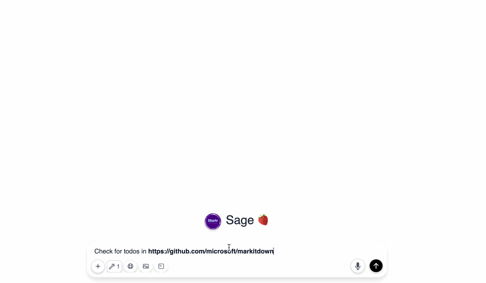

# TODO Scanner

A dead simple tool to find what needs to be done. You have code. Your code has TODOs. This will find them.



## What It Does

The sun rises. The code waits. TODOs hide in your repositories. This scanner finds them with brutal efficiency.

It scans git repositories. It looks for common TODO patterns in comments. It reports them back to you in a clean interface. No fuss. No complexity.

## Why It Matters

We all write notes to ourselves. "Fix this later." "This is a hack." "Come back to this." But we forget. The code grows. The TODOs multiply. They become invisible.

This tool makes the invisible visible again.

## How It Works

1. Give it a git repository URL
2. It clones the repository
3. It scans all text files
4. It finds patterns like `TODO:`, `# TODO`, or `// TODO`
5. It shows you where they hide

## Installation

```bash
git clone https://github.com/yourusername/repo_scanner.git
cd repo_scanner
pip install -r requirements.txt
```

## Usage

### Web Interface

Start the server:

```bash
python app.py
```

Visit `http://localhost:5000` in your browser. Enter a git repository URL. See your TODOs.

### Cloudflare Quick Tunnels

Share your scanner with the world. No ports to open. No firewalls to configure. Just run:

```bash
./run_with_cloudflared.sh
```

The script starts the app. It creates a tunnel. Cloudflare gives you a public URL. Your local scanner becomes available anywhere. Perfect for remote teams. Perfect for demos.

The tunnel is temporary. It dies when the script ends. Your data stays private.

### API

The scanner has a clean API. Use it in your workflows.

```bash
curl -X POST http://localhost:5000/api/mpco/scan_repository \
  -H "Content-Type: application/json" \
  -d '{"repo_url": "https://github.com/username/repository.git"}'
```

## Model Context Protocol OpenAPI

This tool implements the Model Context Protocol (MCP) standard with a parametric OpenAPI specification. AI assistants can use it directly. The API is clean. The documentation is always current.

The manifest endpoint:
```
GET /api/mpco/manifest
```

The OpenAPI spec:
```
GET /api/mpco/openapi.json
```

The API uses the OpenAPI 3.0 standard. The specification is generated dynamically. This means the documentation and implementation are always in sync. No more lies in your API docs.

## Example Output

```json
{
  "repo_url": "https://github.com/username/repository.git",
  "repo_name": "repository",
  "todo_count": 42,
  "todos": [
    {
      "file_path": "src/main.py",
      "line_num": 24,
      "todo_text": "# TODO: Fix this hack when we have time",
      "next_line": "def temporary_solution():"
    }
  ],
  "web_url": "http://localhost:5000/scan/https://github.com/username/repository.git"
}
```

## License

Copyright © 2025 Startr LLC. 

Released under the GNU Affero General Public License v3.0 (AGPL-3.0).

Use it. Share it. Make it better. But keep it open. The full license is in the LICENSE file.

## Contribution

The code is simple. The purpose is clear. If you see how to make it better, make a pull request.

The TODOs are not forever. Find them. Fix them. Make your code clean again.

## Project TODOs

This project hunts TODOs. It has its own TODOs. The irony is not lost.

  1. Add support for more TODO patterns. People write differently. Some use `FIXME:`. Others use `BUG:`.
  
  2. Create a visualization dashboard. See TODO patterns across projects. Find clusters. Identify trends.
  
  3. Add priority detection. Some TODOs are urgent. Find ways to detect them.
  
  4. Build a GitHub webhook integration. Scan repositories automatically on commit.
  
  5. Create a plugin system. Let others extend the scanner for their own patterns.
  
  6. Add language-specific scanning. Comments look different in different languages.
  
  7. Build a CLI tool. Not everyone needs a web interface.

These are not suggestions. These are challenges. Pick one. Build it. The code will be better for it.

