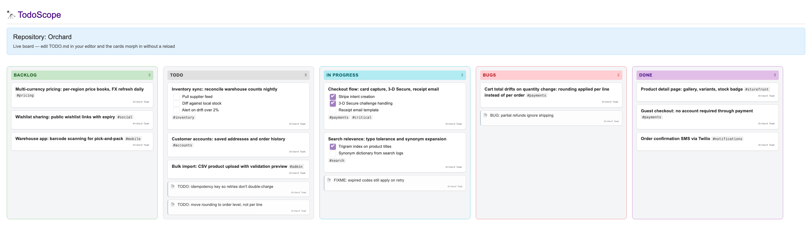
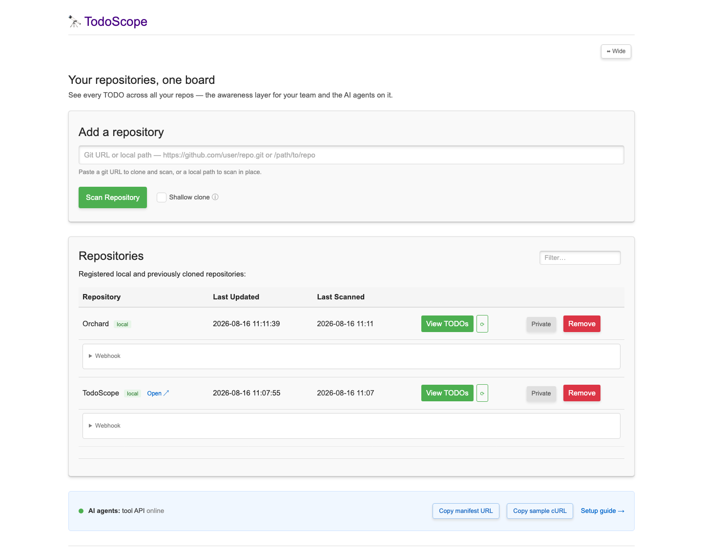

# 🔭 TodoScope

[](https://github.com/Startr/TodoScope)
[](https://www.gnu.org/licenses/agpl-3.0)
[](https://www.python.org/)
[](https://flask.palletsprojects.com/)
[](https://www.docker.com/)
[](https://github.com/Startr/TodoScope#ai--agent-integration)
[](https://github.com/Startr/TodoScope/stargazers)
[](http://localhost:5000/scan_stream/WEB-Sage.is-repo_scanner)
[](https://github.com/Startr/TodoScope/commits)

Every codebase has a to-do list. Most of them are a mess. TodoScope is about the gap between what teams say they'll fix and what actually gets done — and what that gap reveals about how software really gets built.

**Give your AI assistant a live view of every TODO across all your repos.**

Connect [Sage.is](https://sage.is), [Claude.ai](https://claude.ai), or any assistant that can call an HTTP API, and ask: *"What's still TODO in this project?"* TodoScope answers instantly. It also gives your team a clean web UI to browse, track, and stay on top of inline TODOs and TODO.md files — without leaving the codebase.

The code is open. The project evolves. Get involved.



Every TODO.md section and every inline `TODO` / `FIXME` / `BUG` comment across
your repos, on one board. Edit a file in your editor and the cards morph in —
no reload.



## AI & Agent Integration

TodoScope implements the [Model Context Protocol](https://modelcontextprotocol.io), making it a first-class tool for AI assistants.

*   **Sage.is AI** and **Claude.ai** can call TodoScope directly — ask your assistant to list, summarize, or prioritize TODOs across any repo it has access to.
*   Clients discover TodoScope through its manifest and its OpenAPI spec — plain HTTP, no SDK.
*   The OpenAPI spec is generated dynamically — the docs always match the live API.

| Endpoint | Purpose |
|---|---|
| `GET /api/mcpo/manifest` | Service discovery manifest |
| `GET /api/mcpo/openapi.json` | Live OpenAPI 3.0 spec |
| `POST /api/mcpo/scan_repository` | Scan a repo, return all TODOs as JSON |

### The todo-scope Skill

TodoScope reads a simple TODO.md convention: sections map to kanban columns, bold checkbox items become cards, indented checkboxes become each card's checklist. The `todo-scope` Claude Code skill gets any repo's TODO.md into that shape — it bootstraps a missing TODO.md, restructures a messy one, groups stray one-liners into proper cards, and sets up `.todoscope-exclude.csv`.

The skill ships in this repo at [.claude/skills/todo-scope/SKILL.md](.claude/skills/todo-scope/SKILL.md) and loads automatically for Claude Code sessions here. To use it in your own repos, install it globally:

```bash
mkdir -p ~/.claude/skills/todo-scope
curl -o ~/.claude/skills/todo-scope/SKILL.md \
  https://raw.githubusercontent.com/Startr/TodoScope/master/.claude/skills/todo-scope/SKILL.md
```

Then run `/todo-scope` in any project.

## What It Does

TODOs pile up. They hide in comments, sit in TODO.md files, and get forgotten across repos. TodoScope finds them all:

*   **AI-ready API:** plain HTTP with an OpenAPI spec — Sage.is, Claude, and other assistants query it directly.
*   **Streaming scan:** See TODOs appear in real time as files are scanned.
*   **TODO.md support:** Detects and renders standalone TODO files alongside inline code comments.
*   **Live refresh:** Watches local repos for changes and updates the view without a full rescan.
*   **Local repo management:** Register local paths — paths stay on the server, never exposed to the browser.
*   **.gitignore aware:** Skips files and directories your project ignores.

## How It Works

1.  Provide a Git URL or register a local repo path.
2.  TodoScope clones (or reads) the repository.
3.  It scans all text files for TODO patterns and finds standalone TODO.md files.
4.  Results stream to the web UI and are available via the API.

## Installation

### macOS app via Homebrew (recommended)

```bash
brew install --cask sage-is/apps/todoscope
```

A native desktop app: real window, Dock icon, menu-bar icon with Open and Quit.
Releases are unsigned until our Apple Developer ID lands; the cask removes the
quarantine bit at install so the app opens on first double-click. Data lives in
`~/.todoscope/`.

### macOS .app via DMG

Download `TodoScope-<version>.dmg` from [Releases](https://github.com/Startr/TodoScope/releases), drag to Applications.
The DMG is unsigned for now — macOS will refuse to open it until you clear
quarantine: `xattr -dr com.apple.quarantine /Applications/TodoScope.app`.
Prefer the Homebrew cask, which does this for you.

### Standalone binary (no Python required)

Download from [GitHub Releases](https://github.com/Startr/TodoScope/releases) and run:

```bash
./todoscope
```

Opens your browser to `http://localhost:5000`. Data stored in `~/.todoscope/`.

### Local development

Requires Python 3.11+ and Git.

```bash
git clone https://github.com/Startr/TodoScope.git GIT-TodoScope
cd GIT-TodoScope
pip install pipenv
cd scanner && pipenv install
cd ..
make it_run_dev
```

Open `http://localhost:5000`. The security warning on the page walks you through setting your first access key.

### Docker

```bash
git clone https://github.com/Startr/TodoScope.git GIT-TodoScope
cd GIT-TodoScope
make it_build
make it_run SECRET_KEY=$(python3 -c "import secrets; print(secrets.token_hex(32))")
```

Cloned repositories and your `access_keys.csv` are mounted from the host, so they survive container restarts.

### CapRover

Deploy from the CapRover dashboard using the included `caprover-one-click.yml`, or add this repo as a custom one-click source. Set the `SECRET_KEY` variable during setup. After deployment, visit the app URL and set your first access key via the security panel.

### Cloudflare Quick Tunnel

To share a local instance publicly for demos:

```bash
make run_tunnel
```

### API Endpoints

The scanner provides a RESTful API. Key endpoints include:

*   **Scan Repository:**
    ```bash
    curl -X POST http://localhost:5000/api/mcpo/scan_repository \
      -H "Content-Type: application/json" \
      -d '{"repo_url": "https://github.com/username/repository.git"}'
    ```
*   **List Local Repositories:**
    ```bash
    curl -X GET http://localhost:5000/api/mcpo/list_repositories
    ```
*   **Pull Repository Updates:**
    ```bash
    curl -X POST http://localhost:5000/api/mcpo/pull_repository \
      -H "Content-Type: application/json" \
      -d '{"repo_name": "repository_name_from_list"}'
    ```

#### Example API Output (Scan Repository)

```json
{
  "repo_url": "https://github.com/username/repository.git",
  "repo_name": "repository",
  "todo_count": 42,
  "todos": [
    {
      "file_path": "src/main.py",
      "line_num": 24,
      "todo_text": "# TODO: Fix this hack when we have time",
      "next_line": "def temporary_solution():"
    }
    // ... more TODOs
  ],
  "web_url": "http://localhost:5000/scan/https://github.com/username/repository.git"
}
```

## Project TODOs

This project, while dedicated to finding TODOs, has its own list of desired enhancements and features. Contributions are welcome!

<!-- BEGIN PROJECT TODOS -->
<!-- This section is automatically generated from TODO.md. Edits here will be overwritten. -->
## In Progress

## TODO

### Brand & Landing Page — Scope E (First-Run & Onboarding)

- [ ] **First-run onboarding**: wizard, demo repo, try-it-live

### todo-scope Skill — Publish & Promote

- [ ] **Publish the todo-scope skill**: ship with the repo, package, document install
- [ ] **Promote the skill**: in-app nudges and outreach

### Features

- [ ] **Explore scan results**: search, README context, metrics, exports

### Tech Debt

- [x] **Refactor `stream_results.html` JS**: superseded — the hand-built DOM builders are deleted; the server renders partials and the client morphs them (see Phase 2 live board).

## Backlog

- [ ] **MCPO: settle the MCP story** (rename shipped)
- [ ] **Share-on-Network firewall test**: verify the desktop app's tray share toggle across the macOS application firewall — accept the incoming-connections prompt, reach the LAN URL from a second device, sign in with an access key. Local curl-to-own-LAN-IP is filtered on the dev Mac, so this needs a real second device.
- [ ] **Inline TODO completion tracking**: Snapshot-and-diff approach to detect when inline TODOs are removed between scans and show them as completed in the Done column. Uses `.todoscope-snapshot.json` and `.todoscope-done.json`. Git-history-independent — works on shallow clones.
- [ ] **TODO editor — remaining scope**: add-TODO form, edit card text, and drag-between-columns write-back. Checkbox toggling shipped (see Phase 2 live board).
- [ ] **Publish CapRover one-click app source**: Add `caprover-one-click.yml` to the Sage-is one-click repo
- [ ] **Scanner extensibility**: smarter parsing, plugins, external integrations
- [ ] **Ralph-loop agent mode**: agent loop with TODO.md as the state file

### Release Pipeline — Repo Rename

- [x] **Rename GitHub repo**: `Startr/WEB-MCPO-Repo_scanner` → `Startr/TodoScope`
- [x] **Update Docker image**: `ghcr.io/startr/todoscope`
- [x] **Update all internal references**: pyproject.toml, scripts, templates, docs, README, CapRover
- [x] **Convention**: clone to `GIT-TodoScope/` locally for dev clarity
- [x] **Verified**: 45 tests passing, all links updated

### Release Pipeline — Docker CLI Wrapper + Dev Mode

- [x] **Create `scripts/todoscope`**: bash CLI wrapper (11 commands, dev mode, tunnels)
- [x] **Dev mode**: smart repo discovery, source mounting, hot reload
- [x] **Tunnel commands**: `todoscope tunnel` + `todoscope tailscale`
- [ ] **Verify end-to-end**: `scripts/todoscope start` → open → dev → tunnel (needs Docker image built)

### Release Pipeline — PyInstaller Binary Build (macOS + Linux + Windows)

- [x] **Create `todoscope.spec`**: PyInstaller spec file (two targets: CLI onefile + .app windowed)
- [x] **Add dev deps to Pipfile**: pyinstaller, build, twine
- [x] **Makefile targets**: binary, binary_dir, app, dmg, pypi_build, pypi_publish, clean_dist
- [x] **Verified**: `make binary` → `dist/todoscope` (11MB ARM64) → `./dist/todoscope --version` → `1.0.0`
- [ ] **Cross-platform binaries — build & verify**

### Release Pipeline — Mac .app + DMG + Menu Bar

- [x] **Build .app**: `make app` → TodoScope.app wrapper around PyInstaller binary
- [x] **Create DMG**: `make dmg` → styled DMG via `create-dmg` with background + Applications link
- [x] **App icon**: real 🔭 Apple Color Emoji via canvas+receiver (`scripts/generate_emoji_icon.sh`)
- [x] **Menu bar icon**: 🔭 on transparent background via canvas+receiver (`scripts/generate_menu_icon.sh`)
- [x] **pystray menu bar app**: 🔭 in menu bar with Open Browser, Show Log, Quit
- [x] **Dock icon toggle**: Hide/Show Dock Icon menu item via NSApp.setActivationPolicy ctypes
- [x] **Duplicate instance prevention**: detects running server, opens browser instead
- [x] **Data persistence**: local_repos.yaml, access_keys.csv, repositories all in `~/.todoscope/`
- [x] **Verified**: .app launches → Dock icon bounces → 🔭 in menu bar → browser opens → all menu items work

### Release Pipeline — Makefile Targets + Local Cross-Platform Builds

- [x] **Makefile targets**: binary, binary_dir, app, dmg, pypi_build, pypi_publish, clean_dist
- [x] **Icon wired**: `--icon assets/todoscope.icns` in app target
- [x] **Styled DMG**: `create-dmg` with background, icon positions, Applications drop link
- [x] **Cross-platform builds** (Docker, zero cloud CI):
- [x] **`scripts/release_all.sh`**: one command builds ALL artifacts + uploads via `gh` CLI
- [x] **`make release_all` target**: calls release_all.sh
- [ ] **Code signing**: Developer ID credentials — consumed by the Tauri shell's bundler, per [the verdict](docs/efforts/app-shell-v2/decisions/the-verdict.md)
- [ ] **Verify full release**: `make release_all` → all artifacts built + uploaded

### Release Pipeline — Homebrew Tap

- [ ] **Homebrew tap**: formula, cask, ecosystem updates

### Release Pipeline — Automated Release Flow

- [ ] **One-command release**: `make patch_release` + `make release_finish` triggers everything
- [ ] **Version single-source-of-truth**: `scanner/__init__.py` drives everything

### Release Pipeline — Future Enhancements

- [ ] **Tray & Dock polish**: platform icon behavior across macOS, Linux, Windows
- [ ] **Tauri shell (v2.0)**: built 2026-08-15 — `src-tauri/` shell, `make tauri_dev`/`tauri_build`/`tauri_dmg`, cask route; settled points in [shell build choices](docs/efforts/app-shell-v2/decisions/shell-build-choices.md)
- [ ] **Branding & Poka-Yoke audit**: ensure all user-facing text, errors, and flows are clear and mistake-proof for v1

## Bugs

- [ ] **`make binary` output is clobbered by the sidecar build**: `release_all.sh` runs `make binary` (onefile → `dist/todoscope`) then `make tauri_dmg` → `sidecar_dir` → `make binary_dir`, whose onedir output replaces `dist/todoscope` with a *directory*. The upload step tests `[[ -f ... ]]`, so the macOS binary is silently skipped from the release. Caught by hand during the v1.1.0 release; the binary was rebuilt and uploaded separately. Fix: stage the onefile before the DMG build, or give the two targets separate output paths.
- [ ] **`cli.py` overrides `TODOSCOPE_DATA_DIR` instead of honouring it**: [cli.py:144](scanner/cli.py#L144) assigns `~/.todoscope` unconditionally, so an operator or test cannot point the CLI at another data dir. Fix: `os.environ.get("TODOSCOPE_DATA_DIR") or os.path.expanduser("~/.todoscope")`.
- [ ] **TODO.md's own convention table becomes kanban cards**: the blockquote table at the head of this file (and the copies in README/TODO_CONVENTION) parses into cards like "In Progress | ## In Progress | # FIXME:". Blockquoted table rows should not produce cards.

## Completed

- [x] **v1.1.0 released**: tagged on master, GitHub release with macOS binary + Linux binary + DMG, clean GHCR image, cask published to `Sage-is/homebrew-apps` — `brew install --cask sage-is/apps/todoscope`. Cask verified by rehearsing the real install (download → sha match → quarantine flag → postflight strip → launch → `/health` reports 1.1.0, `/api/mcpo/manifest` 200) — 2026-08-16
- [x] **SECURITY: access keys leaked in the public Docker image**: no `.dockerignore` existed, so `COPY . /app/` swept the gitignored `scanner/access_keys.csv` into `ghcr.io/startr/todoscope`. Tags `v1.0.0`, `v1.1.0`, `latest` all carried a live key. Remediated 2026-08-16: key rotated, `.dockerignore` added (build context 3.85 GB → 35 MB), clean images pushed over `v1.1.0` and `latest`. **Still open: delete the leaked GHCR versions (needs `delete:packages` scope) and untrack `scanner/local_repos.yaml`.**
- [x] **Fix inline TODO comments rendering as markdown headings**: `#` doubles as `<h1>`, so `# TODO: x` painted as a giant heading; `inline_todo_to_card` now strips comment syntax. 10 tests — 2026-08-16
- [x] **Fix "Last Scanned" always reading never**: scan state is keyed by directory basename, the lookup used the display name — any repo registered under a different name showed `never`. Regression test added — 2026-08-16
- [x] **Fix `local_path` leak**: scan-stream `init` now includes the filesystem path for authed viewers only (no-keys instances unaffected); locked by 2 tests in `test_public_repo_privacy.py` — 2026-08-15
- [x] **Incremental-scan benchmark**: `test_incremental_scan_perf.py`, 400-file fixture timed with timeit — full 6.21s, incremental 0.58s (10.7x), cached 0.09s (65.8x); 2x floor asserted in CI — 2026-08-15
- [x] **Documentation refresh**: all four docs rewritten against current code and fresh-eyes verified; 6 verifier findings fixed, incl. `pipenv run todoscope` now working from a fresh clone (editable install in scanner/Pipfile) — 2026-08-15, full records in [completed-todos](docs/completed-todos.md)
- [x] **Brand & Landing — Scope D (Brand Consistency)**: 24-finding voice audit applied; false MCP claim relabeled "tool API"; error messages moved to founder voice — 2026-08-15
- [x] **Brand & Landing — Scope C (MCP / Sage.is Integration)**: `/connect` page, dashboard tool-API strip with live status dot, `docs/connect-sage.md` with screenshots — 2026-08-15
- [x] **Brand & Landing — Scope B (Dashboard)**: header + pitch, unified smart repo input with live hint, empty state, table filter, Last Scanned + force-rescan — 2026-08-15
- [x] **Brand & Landing — Scope A (Logged-Out Landing)**: hero, features strip, screenshot, agent section, OG meta — 2026-08-15
- [x] **Multi-host repo support**: GitHub / GitLab / Codeberg / Bitbucket / sourcehut + pure-local; five verification lanes pass; no-origin stream bug fixed — 2026-08-15
- [x] **Incremental scans + live board (Phase 2)**: git-diff incremental with scan_state (six-scenario verify), server-rendered fragments, `/events` SSE, watchdog, checkbox write-back — 2026-08-15
- [x] **Release Pipeline — Package Foundation**: pyproject.toml, scanner/cli.py entry point, frozen-app + data-dir support in app.py, `__version__` single source; verified via `pip install -e .`
- [x] **Subdirectory Migration**: Python files, tests, and Pipfiles under scanner/; imports and Makefile updated, exercised end-to-end 2026-08-15
- [x] **Speed up scan**: cached KANBAN board loads instantly on page load while full scan runs in background
- [x] **Fix existing repositories not working**
- [x] **Robust error handling**: custom exceptions, retries, and recovery strategies
- [x] **Broaden TODO pattern recognition**: FIXME, BUG, NOTE in various comment formats
- [x] **DRY Makefile targets**
- [x] **Enable streaming of API results**
- [x] **TODO.md and TODO.txt file detection**
- [x] **Web interface for displaying TODO files**
- [x] **MCPo API for TODO files**
- [x] **GitHub webhook integration** for automated repository scanning
- [x] **TODO file processing**: diverse filenames, root and subdirectory scanning, content display
- [x] **Testing infrastructure**: unit and integration tests
- [x] **Makefile targets and test runner**
- [x] **Honor .gitignore patterns** during repository scans
- [x] **Stream scan results** in the web UI
- [x] **HTML escaping** for multi-line display
- [x] **Fix server hanging** after completing scans
- [x] **Skip `scanner/repositories/`** when scanning this project as a local repo
- [x] **User authentication**: access_keys.csv with session and Bearer token auth
- [x] **Footer update**: cross-links to sage.is and startr.style
- [x] **Rename "Todoscope" to "TodoScope"** consistently
- [x] **Favicon**: telescope emoji
- [x] **Page titles**: descriptive, brand-consistent `<title>` tags
- [x] **Noindex on login page**
- [x] **Meta description**: one-line pitch as default meta description
- [x] **YAML config migration**: `local_repos.yaml` with public/webhook metadata
- [x] **Line-number tracking** in `parse_todo_md()` for all cards and children
- [x] **Kanban resource links**: board guide, `/resources` page, footer link
- [x] **Configurable editor link targets**: vscode.dev, VS Code, Cursor, JetBrains, custom URI templates
- [x] **Public repo views**: per-repo public flag, auth bypass for read-only routes
- [x] **Webhook refresh**: HMAC-SHA256 verification, rate limiting, pull + kanban rebuild
- [x] **Git author visualization**: blame enrichment, author badges on kanban cards
<!-- END PROJECT TODOS -->

## Changelog

### v0.0.1 — First Release (2026-04-16)

- Access key authentication with CSV-backed key management and login/logout flow
- Live TODO count badge endpoint (`/api/badge/todos/:repo`)
- Streaming scan results in the web UI via SSE
- Agent-ready API: manifest, OpenAPI spec, and `scan_repository` endpoint
- Broadened TODO pattern recognition: `FIXME`, `BUG`, `NOTE` alongside `TODO`
- `.gitignore`-aware scanning; skips `scanner/repositories/` in local scans
- TodoScope branding: naming, favicon, meta/OG tags, footer ecosystem links
- Landing page with hero copy, feature strip, and embedded demo GIF
- code.dev deep-link for every registered repository
- Robust error handling with custom exceptions, retries, and recovery strategies
- Unit and integration test suite with Makefile runner targets
- CapRover one-click deployment config (`caprover-one-click.yml`)

## License

Copyright © 2025 Startr LLC.

Released under the GNU Affero General Public License v3.0 (AGPL-3.0).

Use it. Share it. Make it better. But keep it open. The full license text is available in the `LICENSE` file.

## Contribution

Contributions are highly encouraged! If you have an idea for improvement or a bug fix, please:

1.  Fork the repository.
2.  Create a new branch for your feature or fix.
3.  Make your changes.
4.  Submit a pull request with a clear description of your changes.

Let's work together to make this tool even better and help keep our codebases clean and manageable!

