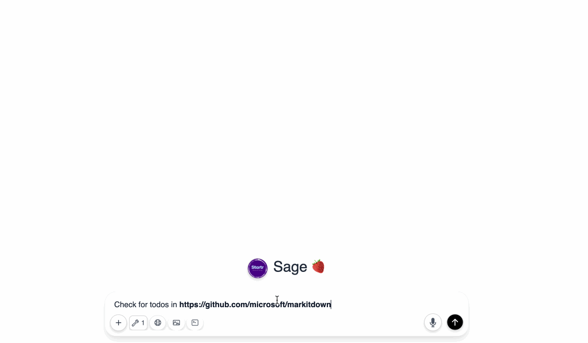

# TODO Scanner

[](https://github.com/Startr/WEB-MCPO-Repo_scanner)

**Give your AI assistant a live view of every TODO across all your repos.**

Connect [Sage.is](https://sage.is), [Claude.ai](https://claude.ai), or any MCP-compatible assistant and ask: *"What's still TODO in this project?"* Todoscope answers instantly. It also gives your team a clean web UI to browse, track, and stay on top of inline TODOs and TODO.md files — without leaving the codebase.

The code is open. The project evolves. Get involved.



## AI & MCP Integration

Todoscope implements the [Model Context Protocol](https://modelcontextprotocol.io), making it a first-class tool for AI assistants.

*   **Sage.is AI** and **Claude.ai** can call Todoscope directly — ask your assistant to list, summarize, or prioritize TODOs across any repo it has access to.
*   Any MCP-compatible client discovers Todoscope automatically via its manifest endpoint.
*   The OpenAPI spec is generated dynamically — the docs always match the live API.

| Endpoint | Purpose |
|---|---|
| `GET /api/mpco/manifest` | Service discovery for MCP clients |
| `GET /api/mpco/openapi.json` | Live OpenAPI 3.0 spec |
| `POST /api/mpco/scan_repository` | Scan a repo, return all TODOs as JSON |

## What It Does

TODOs pile up. They hide in comments, sit in TODO.md files, and get forgotten across repos. Todoscope finds them all:

*   **AI-ready API:** MCP-compliant — Sage.is, Claude.ai, and other assistants query it directly.
*   **Streaming scan:** See TODOs appear in real time as files are scanned.
*   **TODO.md support:** Detects and renders standalone TODO files alongside inline code comments.
*   **Live refresh:** Watches local repos for changes and updates the view without a full rescan.
*   **Local repo management:** Register local paths — paths stay on the server, never exposed to the browser.
*   **.gitignore aware:** Skips files and directories your project ignores.

## How It Works

1.  Provide a Git URL or register a local repo path.
2.  Todoscope clones (or reads) the repository.
3.  It scans all text files for TODO patterns and finds standalone TODO.md files.
4.  Results stream to the web UI and are available via the API.

## Installation

### Local development

Requires Python 3.11+ and Git.

```bash
git clone https://github.com/Startr/WEB-MCPO-Repo_scanner.git
cd WEB-MCPO-Repo_scanner
pip install pipenv
cd scanner && pipenv install && pipenv run python ../app.py
```

Open `http://localhost:5000`. The security warning on the page walks you through setting your first access key.

### Docker

```bash
git clone https://github.com/Startr/WEB-MCPO-Repo_scanner.git
cd WEB-MCPO-Repo_scanner
make docker-build
make docker-run SECRET_KEY=$(python3 -c "import secrets; print(secrets.token_hex(32))")
```

Cloned repositories and your `access_keys.csv` are mounted from the host, so they survive container restarts.

### CapRover

Deploy from the CapRover dashboard using the included `caprover-one-click.yml`, or add this repo as a custom one-click source. Set the `SECRET_KEY` variable during setup. After deployment, visit the app URL and set your first access key via the security panel.

### Cloudflare Quick Tunnel

To share a local instance publicly for demos:

```bash
make run-tunnel
```

### API Endpoints

The scanner provides a RESTful API. Key endpoints include:

*   **Scan Repository:**
    ```bash
    curl -X POST http://localhost:5000/api/mpco/scan_repository \
      -H "Content-Type: application/json" \
      -d '{"repo_url": "https://github.com/username/repository.git"}'
    ```
*   **List Local Repositories:**
    ```bash
    curl -X GET http://localhost:5000/api/mpco/list_repositories
    ```
*   **Pull Repository Updates:**
    ```bash
    curl -X POST http://localhost:5000/api/mpco/pull_repository \
      -H "Content-Type: application/json" \
      -d '{"repo_name": "repository_name_from_list"}'
    ```

#### Example API Output (Scan Repository)

```json
{
  "repo_url": "https://github.com/username/repository.git",
  "repo_name": "repository",
  "todo_count": 42,
  "todos": [
    {
      "file_path": "src/main.py",
      "line_num": 24,
      "todo_text": "# TODO: Fix this hack when we have time",
      "next_line": "def temporary_solution():"
    }
    // ... more TODOs
  ],
  "web_url": "http://localhost:5000/scan/https://github.com/username/repository.git"
}
```

## Project TODOs

This project, while dedicated to finding TODOs, has its own list of desired enhancements and features. Contributions are welcome!

<!-- BEGIN PROJECT TODOS -->
<!-- This section is automatically generated from TODO.md. Edits here will be overwritten. -->
## High Priority
- [ ] Broaden TODO pattern recognition (e.g., FIXME, BUG, NOTE). #core #parser
- [ ] Implement priority inference from TODO comments. #core #parser
- [ ] Enable streaming of API results for improved responsiveness. #api #performance

## Medium Priority
- [ ] Add detection for language-specific comment syntax. #core #parser #enhancement
- [ ] Develop a dashboard to visualize TODO metrics across projects. #reporting #ux
- [ ] Offer report downloads in multiple formats (CSV, JSON, PDF). #reporting #feature
- [ ] Integrate with GitHub webhooks for automated repository scanning. #integration #automation
- [ ] Enhance TODO file processing: #feature #core
    - [ ] Recognize diverse TODO filenames (e.g., TODO.md, todo.txt). #detection
    - [ ] Scan TODO files located in the project root directory. #discovery
    - [ ] Extend scanning to TODO files within subdirectories. #discovery
    - [ ] Display content from identified TODO files. #rendering #ux

## Low Priority
- [ ] Introduce user authentication for secure access. #security #auth
- [ ] Design a plugin system to extend scanner functionality. #architecture #extensibility
- [ ] Facilitate integration with task managers (Jira, Asana, Trello). #integration #external
- [ ] Create a command-line interface (CLI) for versatile use. #cli #accessibility
- [ ] Improve visibility of scrollable local repositories list on the main page. #ux #frontend

## Completed
- [x] Honor .gitignore patterns during repository scans.
- [x] Stream scan results efficiently in the web UI.
- [x] Ensure proper HTML escaping for multi-line display.
<!-- END PROJECT TODOS -->

## License

Copyright © 2025 Startr LLC.

Released under the GNU Affero General Public License v3.0 (AGPL-3.0).

Use it. Share it. Make it better. But keep it open. The full license text is available in the `LICENSE` file.

## Contribution

Contributions are highly encouraged! If you have an idea for improvement or a bug fix, please:

1.  Fork the repository.
2.  Create a new branch for your feature or fix.
3.  Make your changes.
4.  Submit a pull request with a clear description of your changes.

Let's work together to make this tool even better and help keep our codebases clean and manageable!

