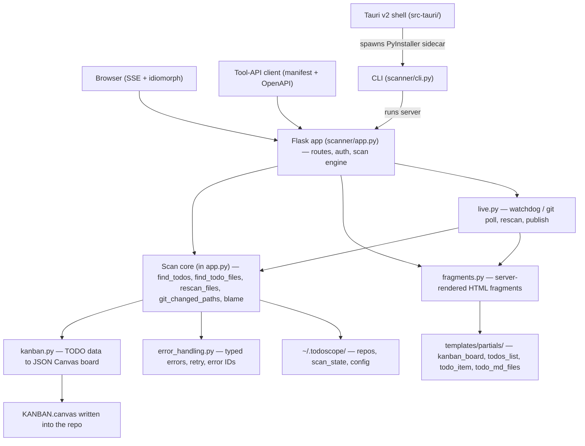

# Architecture Overview

TodoScope is a Flask app in the `scanner/` package. It scans git repos for
inline TODO comments and TODO.md files, renders a kanban board from them, and
keeps that board live over SSE. The root `app.py` is a ten-line shim that
imports `scanner.app`.

## Components



### Flask app (`scanner/app.py`)

Routes, auth, and the scan engine in one module.

- **Dashboard** (`/`): unified repo input — a URL clones, a local path
  registers (`_classify_repo_input`). Repo table shows Last Scanned and a
  force-rescan control. A tool-API strip probes `/api/mpco/manifest` and
  offers copy shortcuts; the full guide lives at `/connect`.
- **Scan pages**: `/scan_stream/<repo>` renders the page,
  `/stream_data/<repo>` streams the scan as SSE. `/scan/<repo>` redirects to
  `/scan_stream/`.
- **Live channel**: `/events/<repo>` — persistent SSE, fragments pushed on
  change.
- **Health**: `/health` returns `{status, app, version, auth}`. Public — the
  desktop shell polls it for readiness and uses `auth` to refuse network
  sharing when no access key exists.
- **Write-back**: `POST /api/todo_toggle/<repo>` flips a checkbox in a
  TODO.md/TODO.txt line. Local repos only, path-traversal guarded, and
  guarded by a per-line md5 hash — a stale view gets 409, never a clobbered
  line.
- **Webhooks**: `POST /api/webhook/<repo>` verifies GitHub
  `X-Hub-Signature-256` (HMAC-SHA256), GitLab `X-Gitlab-Token`, or a Bearer
  token; rate-limited to one trigger per 30 s; pulls, rebuilds the board, and
  notifies live subscribers.
- **Badge**: `/api/badge/todos/<repo>` — shields.io endpoint JSON, public.

### Scan core (in `scanner/app.py`)

- `find_todos()` walks the tree for inline `TODO|FIXME|BUG|NOTE` comments
  (`#`, `//`, `/*`, `<!--`, `;` prefixes), skipping `.git`, `node_modules`,
  `__pycache__`, virtualenvs, git-ignored and binary files, and anything in
  `.todoscope-exclude.csv`.
- `find_todo_files()` collects standalone `TODO.md` / `TODO.txt` files.
- `git_changed_paths()` + `rescan_files()` power incremental scans (below).
- `collect_blame_data()` attributes cards via `git blame` — best-effort,
  never blocks a scan.
- Multi-host link building: `parse_git_origin()` parses https/ssh/scp origin
  URLs for GitHub (file links open in vscode.dev), GitLab (gitlab.com and
  self-hosted `gitlab.*`), Bitbucket, Codeberg (Gitea URL scheme), and
  sourcehut. Unknown host or missing origin remote yields no links — a
  normal state, not an error.

### Fragments renderer (`scanner/fragments.py`)

Single source of truth for what a card, TODO item, or board looks like. The
browser receives finished HTML over SSE and morphs it in with idiomorph — it
never builds board DOM from JSON. Markdown renders server-side with
markdown-it-py plus the tasklists plugin. Each rendered checkbox is stamped
with `data-td-file` / `data-td-line` / `data-td-hash` so `/api/todo_toggle`
can verify the line is still what the viewer saw.

### Live watcher (`scanner/live.py`)

Watchers are lazy: started when the first SSE client subscribes to a repo,
stopped when the last leaves.

- Registered local repos get a recursive watchdog Observer (0.4 s debounce;
  `.git` and `KANBAN.canvas` writes ignored so a scan never triggers itself).
  If watchdog fails, a 2 s fingerprint poll (HEAD + `git status`) takes over.
- Cloned repos get a 60 s `git fetch` poll; upstream drift triggers a pull.
- Rescans are serialized per repo and reuse the incremental path, then
  publish fresh `kanban`, `todo_md_files`, and `todos_list` fragments to
  every subscriber.

### Kanban builder (`scanner/kanban.py`)

Builds a JSON Canvas 1.0 `KANBAN.canvas` from TODO.md sections and inline
keywords, written into the repo on every scan — the code is the source of
truth, the board is a view. Columns: Backlog, TODO, In Progress, Bugs, Done.
Section headers map by alias ("doing" → In Progress); inline keywords map
TODO → TODO, FIXME → In Progress, BUG → Bugs (NOTE produces no card). Two
functional tags: `#bug` moves a card to Bugs, `#critical` elevates it. Also
runnable standalone: `python -m scanner.kanban [/path/to/repo]`.

### Error handling (`scanner/error_handling.py`)

Typed exception hierarchy (`ValidationError`, `NetworkError`,
`GitOperationError`, `FileSystemError`, `ProcessingError`, `SystemError`)
with unique error IDs, an `ErrorHandler` with recovery strategies, and
`RetryConfig`-driven retry decorators.

### CLI (`scanner/cli.py`)

The `todoscope` console script (`[project.scripts]` in `pyproject.toml`).
Serve mode: pick a port (probes upward from `--port` unless `--exact-port`),
set `TODOSCOPE_DATA_DIR=~/.todoscope`, print a banner, open the browser
(unless `--no-browser`), run Flask threaded. Detects an already-running
instance and just opens it. Clean shutdown on SIGINT/SIGTERM.

Flags: `--port` (default 5000), `--host` (default 127.0.0.1),
`--no-browser`, `--exact-port`, `--tunnel` (cloudflared), `--tailscale`,
`--share` (best available, prefers tailscale), `--tray`, `--version`.

Launched from Finder (no tty, no args) it enters tray mode
(`scanner/tray.py`, pystray menu bar app) and logs to
`~/.todoscope/todoscope.log`.

### Tauri shell (`src-tauri/`)

Thin by charter: spawn the PyInstaller onedir sidecar with
`--port <n> --no-browser --exact-port`, wait for `/health`, open a window on
it, kill the sidecar on quit. The port is sticky — saved to
`~/.todoscope/desktop-port` and reused while free, because the WKWebView
origin (and its localStorage) is port-scoped. Sidecar output goes to
`~/.todoscope/desktop-sidecar.log`.

## Auth

Access-key auth, enabled by the presence of `access_keys.csv` (`key,label`
rows). No file or an empty file means open access.

A key is accepted three ways: session login at `/login` (remember-me makes
the session permanent — 30-day lifetime), `?key=` query parameter, or
`Authorization: Bearer <key>`. Browsers without a key are redirected to
`/login`; JSON clients get 401.

Always public: `/health`, `/login`, `/resources`, `/api/mpco/manifest`,
`/api/mpco/openapi.json`, plus `/static/*` and `/api/badge/*`. Webhook
routes skip session auth and verify their own HMAC. Repos flagged public
expose read-only routes (`/scan_stream/`, `/stream_data/`, `/events/`,
`/api/repo_fingerprint/`, `/api/todo_files/`) without a key.

Session signing: `SECRET_KEY` env wins; otherwise a generated key persists
at `~/.todoscope/.secret_key` (mode 0600) so sessions survive restarts;
otherwise per-process random.

## Data Flow

### A scan (`/stream_data/<repo>`, SSE)

1. **Instant paint.** For a known repo: emit `init` (name, branch, parsed
   host parts, `web_file_url_template` with `{path}`/`{line}` placeholders
   left for the client; local repos also get `local_path` for editor URIs),
   then the previous `KANBAN.canvas` rendered stale, then the TODO.md
   fragments. Local working copies are the truth — no pull. Cloned repos
   pull behind the cached board; new repos clone first.
2. **Incremental decision.** Load `scan_state/<repo>.json` (schema 1) unless
   `refresh=1` forced a full rescan. If `last_head` is recorded and
   `exclusions_hash` matches, `git_changed_paths()` combines
   `git diff --name-status <last_head>..HEAD` with
   `git status --porcelain` (untracked included). An unreachable SHA
   (force-push, shallow horizon) falls back to a full scan — the cache can
   never produce stale results.
3. **No change** (ignoring the scanner's own `KANBAN.canvas` writes): serve
   cached todos and blame straight from scan state. No scan runs.
4. **Changed:** `rescan_files()` re-parses only changed files and merges
   over the cache. **No cache:** full `find_todos()` walk, streaming one
   fragment per TODO.
5. **Board.** `build_kanban()` + `write_canvas()` write `KANBAN.canvas` into
   the repo; the `kanban` fragment is emitted. Blame runs after, re-emitting
   the board and list with authors.
6. **Persist.** `save_scan_state()` writes `{schema, last_head,
   exclusions_hash, scanned_at, todos, blame}` atomically (tmp +
   `os.replace`).
7. **Complete.** The client closes the scan stream and subscribes to
   `/events/<repo>`.

### The live board

```text
file save ──► watchdog (0.4 s debounce)      clone: 60 s git fetch poll
                     │                                    │
                     └────────► _rescan_and_publish ◄─────┘
                                (incremental rescan, kanban, blame,
                                 save scan_state, render fragments)
                                          │
                        /events/<repo> SSE (15 s heartbeats)
                                          │
                       browser: Idiomorph.morph(el, html)
```

Checkbox write-back closes the loop: the browser POSTs
`/api/todo_toggle/<repo>` with file, line, and line-hash; the server edits
the TODO file atomically; the file write trips the watchdog, which pushes
the confirming fragments to every subscriber. A 409 means the line changed
since render — the next morph shows reality.

## Tool API (`/api/mpco/*`)

A plugin-style REST surface for AI agents: a manifest plus a generated
OpenAPI spec. It is not the Model Context Protocol — the route paths keep
the historical `mpco` name, but call it the tool API.

```text
/api/mpco/
├── manifest                  GET   tool manifest (points at openapi.json)
├── openapi.json              GET   generated OpenAPI spec
├── scan_repository           POST  clone + scan, JSON results
├── list_repositories         GET   known repos
├── pull_repository           POST  git pull a cached repo
└── scan_repository_stream    POST  scan with streamed progress
```

Responses wrap results as `{"status": "success", "result": ...}` or
`{"status": "error", "error": ...}`.

## Storage Layout

With `TODOSCOPE_DATA_DIR` set (CLI, binary, and desktop launches set it to
`~/.todoscope`):

```text
~/.todoscope/
├── local_repos.yaml      registered repos: name → {path, public, webhook_secret}
│                         (legacy local_repos.json auto-migrates on first read)
├── access_keys.csv       access keys (key,label); absent = auth off
├── .secret_key           persisted Flask session key (0600)
├── scan_state/           per-repo incremental-scan cache, <repo>.json
├── repositories/         cloned repos
├── todoscope.log         app-mode (no-tty) log
├── desktop-port          Tauri shell's sticky sidecar port
└── desktop-sidecar.log   Tauri shell's sidecar output
```

Without it (dev checkout, Docker) the same files live under `scanner/`
(`scanner/repositories/`, `scanner/scan_state/`, `scanner/local_repos.yaml`,
`scanner/access_keys.csv`).

Per scanned repo, two files live in the repo itself: `KANBAN.canvas`
(scanner output, ignored by the change detectors) and
`.todoscope-exclude.csv` (`path,reason` rows; prefix and glob matching).

## Deployment Options

| Option | How | Notes |
| --- | --- | --- |
| Dev / pipenv | `pipenv install` against `scanner/Pipfile`; `python app.py` or `pip install -e .` then `todoscope` | `make test` runs `tools/run_tests.sh` (pytest over `scanner/tests/` with `PIPENV_PIPFILE=scanner/Pipfile`) |
| pip package | `pyproject.toml` at root; console script `todoscope = scanner.cli:main` | Python >= 3.11; deps: flask >= 3.1.0, pyyaml, markdown-it-py, mdit-py-plugins, watchdog. `make pypi_build` / `pypi_publish` |
| Docker | `make it_build` / `it_run`; image `ghcr.io/startr/todoscope` (`make docker_push`) | `python:3.12-slim`, `CMD python app.py`, port 5000. `make it_run_local` mounts `PROJECTS_DIR` at `/mnt/projects`. `scripts/todoscope` is a wrapper CLI around the GHCR image |
| PyInstaller binary | `make binary` (onefile) / `binary_dir` (onedir); `binary_linux` / `binary_windows` via Docker | Bundles templates + static; frozen-app detection in `scanner/app.py` resolves them from the bundle |
| macOS .app / DMG | `make app` / `make dmg` | Plain .app wrapper around the onefile binary; styled DMG via create-dmg |
| Tauri desktop | `make tauri_dev` / `tauri_build` / `tauri_dmg` | Tauri v2, bundles app + dmg; onedir binary as sidecar; version injected from `scanner/__init__.py` |

## Technology Stack

- **Python 3.11+ / Flask** — server, scan engine, SSE
- **Jinja2 + markdown-it-py** — server-rendered fragments
- **watchdog** — local filesystem watching
- **idiomorph** (0.7.4, CDN) — DOM morphing in the browser; vanilla JS otherwise
- **git CLI** via subprocess — clone, pull, diff, status, blame (no GitPython)
- **PyInstaller, Tauri v2 (Rust), Docker, Make** — packaging and automation
- **pytest via pipenv** — tests in `scanner/tests/`

## Security Notes

- Access-key auth as above; keys are plaintext rows in a user-owned file.
- The dashboard repo table and list API show display names only. The scan
  page's `init` SSE event does include a registered local repo's absolute
  path, to power local-editor deep links — so flagging a local repo public
  shares that path with anonymous viewers (open bug, see TODO.md Bugs).
- Write-back is restricted to registered local repos, TODO files only, with
  realpath containment and per-line hash checks.
- Webhooks require a per-repo secret (HMAC or token) and are rate-limited;
  no other endpoint is rate-limited.
- Fragment HTML is escaped server-side; raw comment text passes through
  `escape()` before highlighting.
