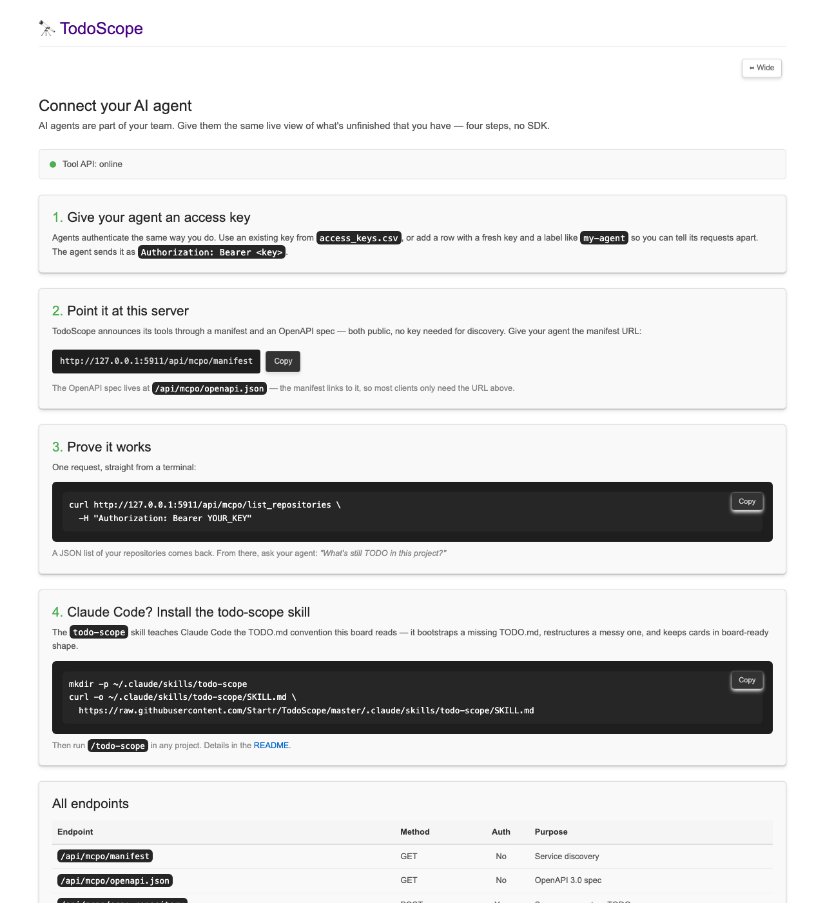
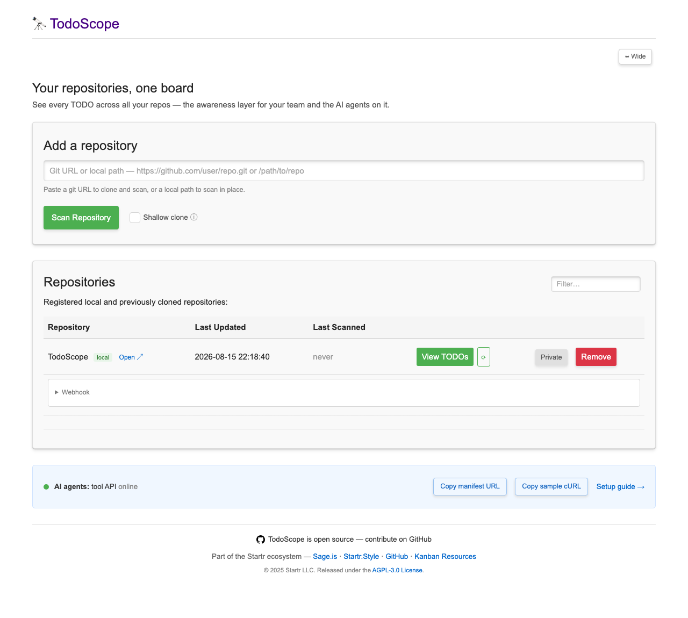

# Connect an AI agent to TodoScope

TodoScope gives AI agents the same live view of unfinished work that your team has.
This guide connects Sage.is — or any agent that can read an OpenAPI spec — in four
steps. The in-app version lives at `/connect` on your TodoScope server.



## 1. Give the agent an access key

Agents authenticate like people do. Add a row to `access_keys.csv` with a fresh key
and a label that names the agent:

```csv
key,label
a-long-random-string,sage-agent
```

The agent sends it on every request as `Authorization: Bearer <key>`.

## 2. Point it at the manifest

TodoScope announces its tools through a public manifest:

```text
https://your-server/api/mcpo/manifest
```

The manifest links to the OpenAPI spec (`/api/mcpo/openapi.json`), so most clients
need only the manifest URL. Both endpoints are public — discovery needs no key.

The dashboard has copy buttons for the manifest URL and a sample request, plus a
live status dot for the tool API:



## 3. Prove it works

```bash
curl https://your-server/api/mcpo/list_repositories \
  -H "Authorization: Bearer YOUR_KEY"
```

A JSON list of repositories comes back. From there, ask the agent:
*"What's still TODO in this project?"* — it answers from live data, not guesswork.

## 4. Claude Code: install the todo-scope skill

The `todo-scope` skill teaches Claude Code the TODO.md convention the board reads:

```bash
mkdir -p ~/.claude/skills/todo-scope
curl -o ~/.claude/skills/todo-scope/SKILL.md \
  https://raw.githubusercontent.com/Startr/TodoScope/master/.claude/skills/todo-scope/SKILL.md
```

Then run `/todo-scope` in any project. Details in the
[README](../README.md#the-todo-scope-skill).

## Endpoint reference

| Endpoint | Method | Auth | Purpose |
| --- | --- | --- | --- |
| `/api/mcpo/manifest` | GET | No | Service discovery |
| `/api/mcpo/openapi.json` | GET | No | OpenAPI 3.0 spec |
| `/api/mcpo/scan_repository` | POST | Yes | Scan a repo, return TODOs |
| `/api/mcpo/scan_repository_stream` | POST | Yes | Stream TODOs (NDJSON) |
| `/api/mcpo/list_repositories` | GET | Yes | List registered repos |
| `/api/mcpo/pull_repository` | POST | Yes | Pull latest for a repo |
| `/health` | GET | No | Liveness + version + auth state |
